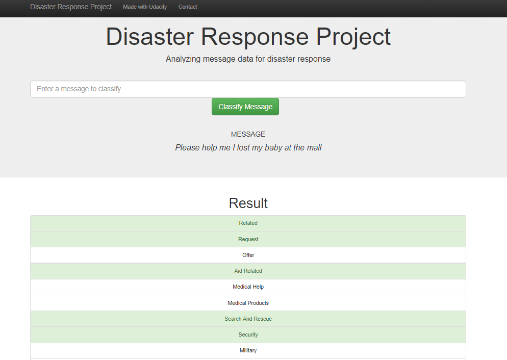

# Disaster Response Pipeline Project
## Summary
- Libraries
- Project Motivation 
- Project Description
- Repository 
- Results
- Instruction to run
- Credits


## Libraries
All libraries are available in Anaconda distribution of Python.

[pandas](https://pandas.pydata.org/pandas-docs/stable/getting_started/install.html) - For data manipulation and analysis;

[numpy](https://numpy.org/doc/stable/user/absolute_beginners.html) - For mathematical functions;

[re](https://docs.python.org/3/library/re.html) - For regular expression;

[sys](https://www.python-course.eu/sys_module.php) - For information about constants, functions and methods; 

[sklearn](https://scikit-learn.org/stable/) - Machine learning library; 

[nltk](https://www.nltk.org/) - Natural Language Toolkit, is a suite of libraries and programs for symbolic and statistical natural language processing for English written in the Python programming language;

[sqlalchemy](https://www.sqlalchemy.org/) - An open-source SQL toolkit and object-relational mapper for the Python programming language;

[pickle](https://docs.python.org/3/library/pickle.html) - For serializing and deserializing a Python object structure;

[Flask](https://flask.palletsprojects.com/en/1.1.x/) - is a micro web framework written in Python;

[sqlite3](https://docs.python.org/3/library/sqlite3.html) -  interfaces for working with the SQLite database;

[pickle](https://docs.python.org/3/library/pickle.html) - implements binary protocols for serializing and de-serializing a Python object structure;

## Project Motivation 

The goal of the project is to analyze disaster data from Figure Eight and build a model for an API that classifies disaster messages. Allow user input a message and get classification results in several categories. 

## Project Description

Build an ETL Pipeline In a Python script, process_data.py, write a data cleaning pipeline that: Loads the messages and categories datasets Merges the two datasets Cleans the data Stores it in a SQLite database

Build a ML Pipeline In a Python script, train_classifier.py, write a machine learning pipeline that: Loads data from the SQLite database Splits the dataset into training and test sets Builds a text processing and machine learning pipeline Trains and tunes a model using GridSearchCV Outputs results on the test set Exports the final model as a pickle file

use Flask Web App to get the user message and classify them into 36 categories. Also include beautiful visualization of the data.

## Repository Description
```
.
├── app
│   ├── run.py------------------------# FLASK FILE THAT RUNS APP
│   │   
│   └── templates
│       ├── go.html-------------------# CLASSIFICATION RESULT PAGE OF WEB APP
│       └── master.html---------------# MAIN PAGE OF WEB APP
├── data
│   ├── DisasterResponse.db-----------# DATABASE TO SAVE CLEANED DATA TO
│   ├── disaster_categories.csv-------# DATA TO PROCESS
│   ├── disaster_messages.csv---------# DATA TO PROCESS
│   └── process_data.py---------------# PERFORMS ETL PROCESS
├── img-------------------------------# PLOTS FOR USE IN README AND THE WEB APP
├── models
│   └── train_classifier.py-----------# PERFORMS CLASSIFICATION TASK

```
## Instructions to run 
1. Run the following commands in the project's root directory to set up your database and model.

    - To run ETL pipeline that cleans data and stores in database
        `python data/process_data.py data/disaster_messages.csv data/disaster_categories.csv data/DisasterResponse.db`
    - To run ML pipeline that trains classifier and saves
        `python models/train_classifier.py data/DisasterResponse.db models/classifier.pkl`

2. Run the following command in the app's directory to run your web app.
    `python run.py`

3. Go to http://0.0.0.0:3001/
   
## Results

### Visualization


### Testing the model



## Credits

Thanks [Udacity](https://www.udacity.com/) for this great and meaningful project. 
Also a big thanks to my mentor [Eduardo Elael](https://github.com/elael), that help me a lot with my struggles 
